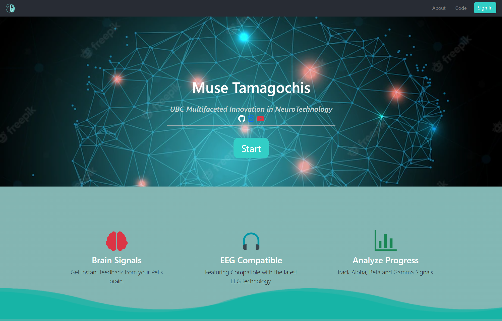
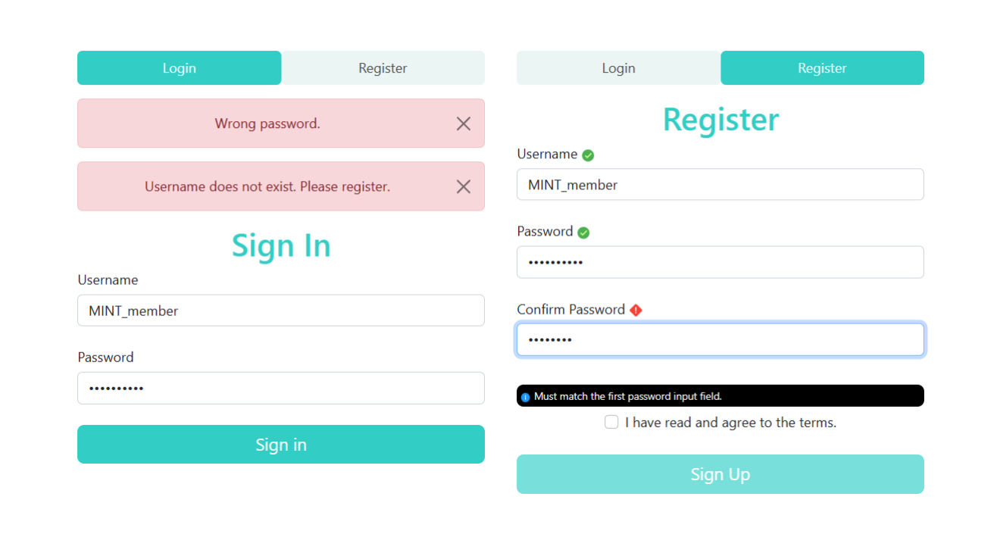
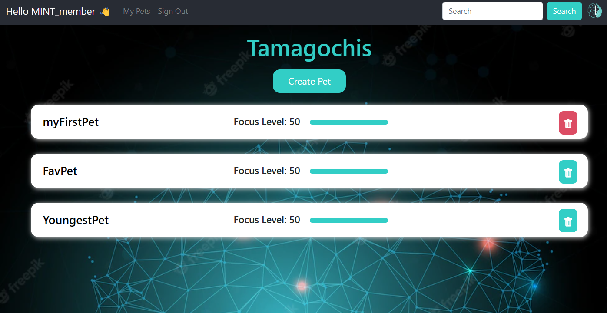
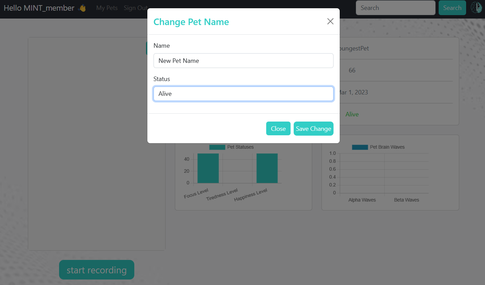

# MUSE-Pet

## Table of Contents

- [Overview](#overview)
- [Hardware](#hardware)
- [Software Architecture](#software-architecture)
- [Signal Processing](#signal-processing)
- [Getting Started](#getting-started)
    * [Prerequisites](#prerequisites)
    * [Installation](#installing)
    * [Running the web app](#running-the-web-app)
    * [Running the signal processing](#running-the-signal-processing)

## Overview

MUSE Pet is a virtual simulator where the health of the pet is affected by the user's mental state. The MUSE headset is used to collect user EEG data, and real time signal processing predicts the user's attentiveness to display on a web app interface.  









## Hardware

The hardware used for this project is the MUSE headset. The MUSE headset is a consumer grade EEG headset that is used to collect EEG data.


## Software Architecture

The software architecture below demonstrates how the MERN stack communicates with the external signal processing tool via HTTP APIs. The external tool collects EEG data from the MUSE headset worn by the user, and the data is processed by the signal processing script, which transforms the data into numeric values based on the user's attentiveness. The processed data is sent to the web server, which updates the information in the MongoDB database in real time.

The attentiveness values are then sent to the web app via HTTP APIs using Axios. The web app displays the user's attentiveness and the pet's health.


The frontend layer consists of React.js and Axios, which is a HTTP client library for making requests from the frontend to the backend.

The backend layer consists of Node.js and Express.js, and an HTTP API that can receive requests from external tools. The Python script that communicates with the backend via POST requests.

The Python script uses the requests library to send POST requests to the HTTP API provided by the backend. The backend processes the request and performs any necessary actions (such as interacting with the database layer).

## Signal Processing

MuseLSL is used to stream data in real time and signal is pre-processed and feature extraction performed.

## Getting Started

### Prerequisites

You will need the following software installed on your system:

* Python 3.6
* MUSE headset
* MUSE SDK
* Node.js (version 14 or later for web app)
* npm (version 6 or later for web app)
* MongoDB (version 4 or later for database)

### Installing

After cloning the repository to your local machine, follow the instructions below to install the necessary dependencies.

To install the dependencies for the web app, run the following command in the software directory:

```
npm install
```

To install the dependencies for the signal processing, run the following command in the signal processing directory:
    
``` 
pip install -r requirements.txt
```

### Running the web app

To run the frontend, navigate to the frontend directory and run the following commands:
```
npm start
```

To run the backend, navigate to the backend directory and run the following commands:
```
nodemon app.js
```

### Running the signal processing script

To run the signal processing script, navigate to the python directory and run the following commands:

```
python neurofeedback.py
```

### Built With

* [MUSE SDK](http://developer.choosemuse.com/) - EEG headset software development kit
* [MongoDB](https://www.mongodb.com/) - The database used
* [Express](https://expressjs.com/) - Backend framework
* [React](https://reactjs.org/) - Frontend framework
* [Node.js](https://nodejs.org/en/) - JavaScript runtime
* [Python](https://www.python.org/) - Signal processing language
  

